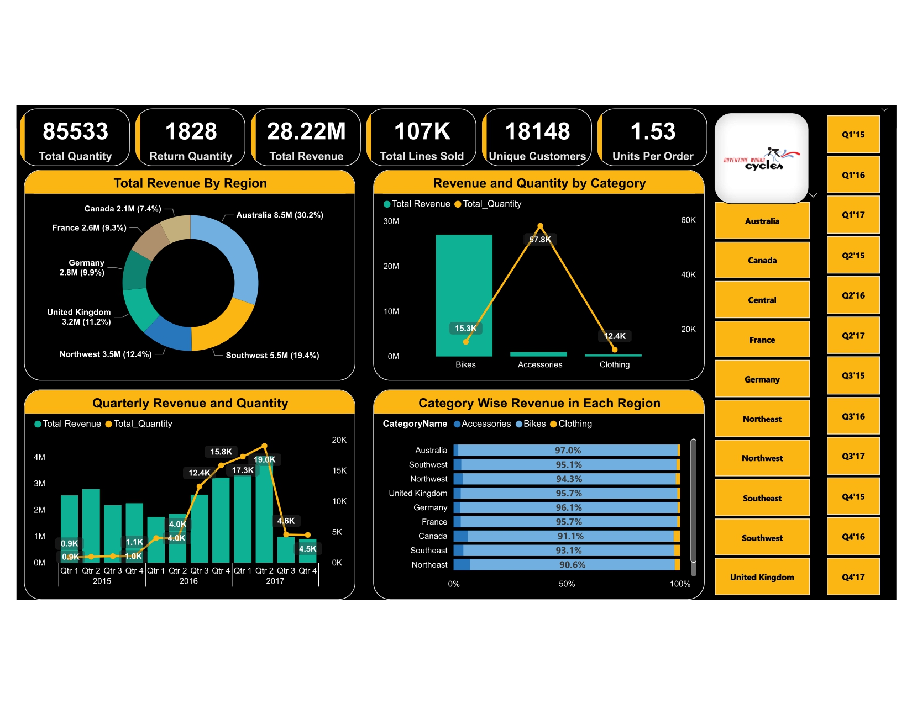
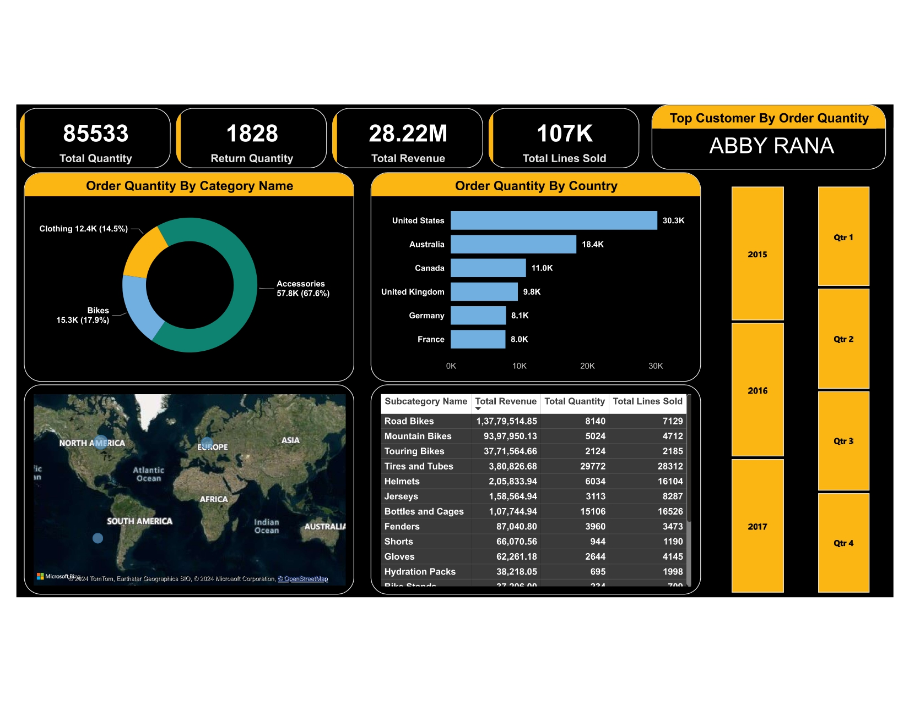

# Adventure Works Sales Power BI Dashboard

## Introduction
This project showcases a comprehensive Power BI dashboard created using data extracted from multiple tables of the Adventure Works Sales database. The dashboard aims to provide actionable insights into sales performance and trends.

## Overview
The Adventure Works Sales Power BI dashboard is designed to facilitate informed decision-making by visualizing key metrics and trends derived from sales data. It consists of two slides, each offering distinct perspectives on sales performance.

## Key Features
1. **Data Extraction:** Data is extracted from multiple tables within the Adventure Works Sales database, ensuring comprehensive coverage of sales-related information.
2. **Data Modeling:** Relationships are established between different tables to enable seamless data integration and analysis.
3. **Dashboard Design:** The dashboard is intuitively designed with a user-friendly interface, making it easy to navigate and interpret the presented information.
4. **Slide 1: Sales Overview:** This slide provides a high-level overview of sales performance, including total sales, top-selling products, and sales distribution by region.
5. **Slide 2: Sales Trends:** The second slide delves deeper into sales trends over time, offering insights into monthly sales trends, seasonality, and year-over-year comparisons.

## Technologies Used
- **Power BI:** The primary tool used for data visualization and dashboard creation.
- **SQL:** Used for data extraction and manipulation from the Adventure Works Sales database.
- **Python Programming:** Leveraged for data preprocessing and advanced analytics.
- **Advance Excel & VBA:** Skills utilized for additional data processing and analysis.

## Acknowledgments
This project was made possible through the guidance and support of F1 MACRO TECHNOLOGIES during the internship period. Special thanks to the mentors for their valuable insights and expertise.

## Dashboard Images
Please insert links to your dashboard images here:
- 
- 
